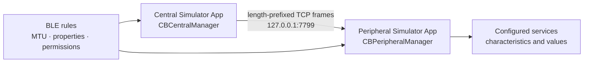

# BluetoothMock

`BluetoothMock` 是給 iOS Simulator 使用的 Swift Package。它提供一組接近 CoreBluetooth 的同名 API，讓一個 Simulator App 扮演 Central、另一個 App 扮演 Peripheral，並透過 `127.0.0.1` 的 TCP 連線交換 GATT 操作。

真機仍應使用 Apple 的 CoreBluetooth；這個套件只用於開發與自動化測試。

```swift
#if targetEnvironment(simulator)
import BluetoothMock
#else
import CoreBluetooth
#endif
```

> 同一個 Swift 檔案不要同時 import `CoreBluetooth` 和 `BluetoothMock`，否則同名型別會產生衝突。

## 直接試用

根目錄的 `BluetoothMockDemo.xcodeproj` 是可直接執行的 SwiftUI App。同一個 App 可選擇 Central 或 Peripheral 角色；在兩台 Simulator 各啟動一個角色，即可測試 read、write、notification 與 MTU 超限拒絕。操作順序請看 [Demo 說明](Demo/README.md)。

## 工作方式



Peripheral App 是 TCP listener，Central App 在 scan 時連線；如果 Peripheral 尚未啟動，Central 會每 400 ms 重試。每個 TCP frame 都有 4-byte big-endian 長度前綴，因此 TCP 拆包與黏包不會改變 GATT 訊息邊界。listener 只接受 loopback peer。

## 加入專案

在 Xcode 使用 **File → Add Package Dependencies → Add Local…**，選取此資料夾，再把 `BluetoothMock` product 加入兩個 App target。

兩邊必須使用相同 TCP port；Central 預設連到 `127.0.0.1`：

```swift
#if targetEnvironment(simulator)
let mockOptions: [String: Any]? = [
    BluetoothMockOption.tcpHost: "127.0.0.1",
    BluetoothMockOption.tcpPort: 7799,
    BluetoothMockOption.attMTU: 247,
    BluetoothMockOption.latencyMilliseconds: 10,
    BluetoothMockOption.rssi: -55,
    BluetoothMockOption.peripheralIdentifier: "D729FA79-9F15-4F25-94C7-28E50A462219"
]
#else
let mockOptions: [String: Any]? = nil
#endif
```

Peripheral 也可加入 `BluetoothMockOption.automaticATTResponses: true`，直接用 characteristic 的 `value` 回覆 read/write。預設為 `false`，此時行為較接近 CoreBluetooth，App 必須在 `didReceiveRead`／`didReceiveWrite` 呼叫 `respond(to:withResult:)`。

## Peripheral 範例

```swift
final class MockPeripheral: NSObject, CBPeripheralManagerDelegate {
    private var manager: CBPeripheralManager!
    private let value = CBMutableCharacteristic(
        type: CBUUID(string: "FFF1"),
        properties: [.read, .write, .notify],
        value: Data([0x01]),
        permissions: [.readable, .writeable]
    )

    override init() {
        super.init()
        manager = CBPeripheralManager(delegate: self, queue: .main, options: mockOptions)
    }

    func peripheralManagerDidUpdateState(_ peripheral: CBPeripheralManager) {
        guard peripheral.state == .poweredOn else { return }
        let service = CBMutableService(type: CBUUID(string: "FFF0"), primary: true)
        service.characteristics = [value]
        peripheral.add(service)
    }

    func peripheralManager(_ peripheral: CBPeripheralManager, didAdd service: CBService, error: Error?) {
        guard error == nil else { return }
        peripheral.startAdvertising([
            CBAdvertisementDataLocalNameKey: "Mock Device",
            CBAdvertisementDataServiceUUIDsKey: [service.uuid]
        ])
    }

    func peripheralManager(_ peripheral: CBPeripheralManager, didReceiveRead request: CBATTRequest) {
        request.value = value.value
        peripheral.respond(to: request, withResult: .success)
    }

    func peripheralManager(_ peripheral: CBPeripheralManager, didReceiveWrite requests: [CBATTRequest]) {
        for request in requests {
            value.value = request.value
            peripheral.respond(to: request, withResult: .success)
        }
    }
}
```

發送 notification：

```swift
let sent = manager.updateValue(
    Data([0x02]),
    for: value,
    onSubscribedCentrals: nil
)
```

`false` 代表 characteristic 不支援 notify/indicate，或資料超出其中一個訂閱端的協商 payload 上限。

## Central 範例

既有 CoreBluetooth 流程可以照常使用：

```swift
final class MockCentral: NSObject, CBCentralManagerDelegate, CBPeripheralDelegate {
    private var manager: CBCentralManager!

    override init() {
        super.init()
        manager = CBCentralManager(delegate: self, queue: .main, options: mockOptions)
    }

    func centralManagerDidUpdateState(_ central: CBCentralManager) {
        guard central.state == .poweredOn else { return }
        central.scanForPeripherals(withServices: [CBUUID(string: "FFF0")])
    }

    func centralManager(
        _ central: CBCentralManager,
        didDiscover peripheral: CBPeripheral,
        advertisementData: [String: Any],
        rssi RSSI: NSNumber
    ) {
        central.stopScan()
        peripheral.delegate = self
        central.connect(peripheral)
    }

    func centralManager(_ central: CBCentralManager, didConnect peripheral: CBPeripheral) {
        peripheral.discoverServices([CBUUID(string: "FFF0")])
    }

    func peripheral(_ peripheral: CBPeripheral, didDiscoverServices error: Error?) {
        guard let service = peripheral.services?.first else { return }
        peripheral.discoverCharacteristics([CBUUID(string: "FFF1")], for: service)
    }
}
```

完整、可分開複製的版本在 [CentralExample.swift](Examples/CentralExample.swift) 與 [PeripheralExample.swift](Examples/PeripheralExample.swift)。

## BLE 限制

套件會在 TCP 邊界重建 CoreBluetooth 操作，並檢查：

| 規則 | 行為 |
|---|---|
| ATT MTU | 雙方協商較小值；設定值限制在 23...517 |
| 單次 write/notify payload | 不得超過 `min(ATT_MTU - 3, 512)`；預設 MTU 23 即 20 bytes |
| GATT attribute value | 最大 512 bytes |
| characteristic properties | read、write、writeWithoutResponse、notify/indicate 均會檢查 |
| attribute permissions | read 必須 `.readable`，write 必須 `.writeable` |
| legacy advertising | 含 3-byte Flags 在內最多 31 bytes；不會偷偷改用 extended advertising |
| UUID | 接受 16-bit、32-bit、128-bit UUID |

需要傳送較大的 application message 時，應像真實 BLE 一樣自行定義分片／序號／重組協定。`BLEPacketizer.fragments(_:attMTU:)` 可依 MTU 切片；BluetoothMock 不會偷偷把一次過大的 GATT write 拆成多次操作。

## 已實作與邊界

已實作 state update、scan/filter、connect/disconnect、service/characteristic discovery、read、write with/without response、subscribe/unsubscribe、notify/indicate、advertisement 與多個 TCP central session。

目前不模擬 RF 訊號、配對／加密、PHY、connection interval、L2CAP、descriptor discovery、background restoration、scan response 與 extended advertising。這些呼叫若是產品邏輯的一部分，應再包一層你自己的 protocol，或擴充 wire protocol；TCP 通道本身沒有 BLE 加密，只適合 localhost 開發環境。

## 測試

```bash
swift test
```

測試包含 BLE 邊界、TCP frame 拆包／黏包，以及真實 localhost 的完整 GATT 流程。若執行環境禁止建立 listener，只有 localhost 整合測試會標記為 skipped。
